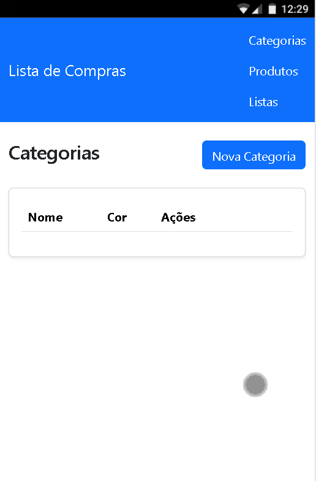

# Lista de Compras Web



Sistema Web desenvolvido em ASP.NET Core MVC para gerenciamento de listas de compras, categorias, produtos e itens de listas, utilizando arquitetura em camadas, persistência em arquivos JSON, AutoMapper e FluentResults.

## 📋 Sobre o Projeto

O Lista de Compras Web é uma aplicação desenvolvida para auxiliar usuários na organização de compras, permitindo o cadastro e gerenciamento de categorias, produtos, listas de compras e itens vinculados às listas.

O sistema foi construído seguindo boas práticas de desenvolvimento, utilizando separação por módulos, arquitetura em camadas e regras de negócio bem definidas.

---

# 🚀 Tecnologias Utilizadas

* ASP.NET Core MVC
* C#
* .NET 8
* Razor Pages
* Bootstrap 5
* AutoMapper
* FluentResults
* JSON para persistência de dados
* Dependency Injection
* Entity Pattern
* Repository Pattern

---

# 📂 Estrutura do Projeto

```text
ListaDeComprasWeb
│
├── Compartilhado
│   ├── EntidadeBase
│   ├── ContextoJson
│   ├── RepositorioBaseEmArquivo
│   └── IRepositorioBase
│
├── ModuloCategoria
│   ├── Dominio
│   ├── Aplicacao
│   ├── Infraestrutura
│   └── Apresentacao
│
├── ModuloProduto
│   ├── Dominio
│   ├── Aplicacao
│   ├── Infraestrutura
│   └── Apresentacao
│
├── ModuloListaCompras
│   ├── Dominio
│   ├── Aplicacao
│   ├── Infraestrutura
│   └── Apresentacao
│
├── ModuloItensListaCompras
│   ├── Dominio
│   ├── Aplicacao
│   ├── Infraestrutura
│   └── Apresentacao
│
└── Program.cs
```

---

# 🏗️ Arquitetura

O sistema segue a arquitetura em camadas:

## Domínio

Responsável pelas entidades e regras de negócio.

Exemplos:

* Categoria
* Produto
* ListaCompras
* ItemListaCompras

---

## Aplicação

Responsável pelos serviços da aplicação.

Exemplos:

* ServicoCategoria
* ServicoProduto
* ServicoListaCompras
* ServicoItemListaCompras

Funções:

* Aplicação das regras de negócio
* Validações
* Integração com repositórios
* Retorno de resultados utilizando FluentResults

---

## Infraestrutura

Responsável pelo acesso aos dados.

Exemplos:

* RepositorioCategoriaEmArquivo
* RepositorioProdutoEmArquivo
* RepositorioListaComprasEmArquivo
* RepositorioItemListaComprasEmArquivo

Persistência realizada em arquivos JSON.

---

## Apresentação

Responsável pela interface MVC.

Contém:

* Controllers
* ViewModels
* Profiles do AutoMapper
* Views Razor

---

# 📦 Módulo de Categorias

## Funcionalidades

* Cadastrar categoria
* Editar categoria
* Excluir categoria
* Visualizar categorias

## Regras de Negócio

* Nome obrigatório
* Nome entre 2 e 100 caracteres
* Não permitir categorias duplicadas
* Não permitir exclusão de categorias com produtos vinculados

---

# 🛒 Módulo de Produtos

## Funcionalidades

* Cadastrar produto
* Editar produto
* Excluir produto
* Visualizar produtos

## Campos

* Nome
* Categoria
* Unidade de Medida
* Preço Aproximado

## Regras de Negócio

* Nome obrigatório
* Nome entre 2 e 100 caracteres
* Categoria obrigatória
* Unidade de medida obrigatória
* Preço aproximado obrigatório
* Não permitir produtos com mesmo nome na mesma categoria

---

# 📝 Módulo de Listas de Compras

## Funcionalidades

* Criar lista
* Editar lista
* Excluir lista
* Visualizar listas

## Campos

* Nome da lista
* Data de criação
* Status

## Regras de Negócio

* Nome obrigatório
* Nome entre 3 e 100 caracteres
* Data criada automaticamente
* Status:

  * Aberta
  * Concluída
* Não permitir exclusão de listas com itens vinculados

## Informações Exibidas

* Quantidade total de itens
* Valor total estimado da lista

---

# 🛍️ Módulo de Itens da Lista

## Funcionalidades

* Adicionar item à lista
* Remover item da lista
* Visualizar itens da lista

## Campos

* Produto
* Quantidade

## Regras de Negócio

* Produto obrigatório
* Quantidade deve ser maior que zero
* Não permitir produtos duplicados na mesma lista
* Valor total calculado automaticamente

## Cálculo

```text
Valor Total = Preço do Produto × Quantidade
```

---

# 🔄 AutoMapper

Utilizado para conversão automática entre:

* Entidades
* DTOs
* ViewModels

Benefícios:

* Redução de código repetitivo
* Maior manutenção
* Melhor organização

---

# ✅ FluentResults

Utilizado para tratamento de sucesso e falha das operações.

Exemplo:

```csharp
Result resultado = servicoProduto.Cadastrar(dto);

if (resultado.IsFailed)
{
    return View();
}
```

Benefícios:

* Tratamento padronizado
* Melhor legibilidade
* Menor uso de exceções

---

# 💾 Persistência dos Dados

A aplicação utiliza persistência baseada em arquivos JSON.

Exemplo:

```json
{
  "categorias": [],
  "produtos": [],
  "listasCompras": [],
  "itensListaCompras": []
}
```

---

# 🎨 Interface

A interface foi construída utilizando:

* Bootstrap 5
* Bootstrap Icons
* Razor Views

Características:

* Layout responsivo
* Navegação simplificada
* Componentes visuais padronizados
* Experiência amigável ao usuário

---

# ⚙️ Configuração do Projeto

## Clonar o Repositório

```bash
git clone <url-do-repositorio>
```

---

## Restaurar Dependências

```bash
dotnet restore
```

---

## Executar o Projeto

```bash
dotnet run
```

---

## Abrir no Navegador

```text
https://localhost:xxxx
```

---

# 📌 Funcionalidades Implementadas

## Categorias

* [x] Cadastrar
* [x] Editar
* [x] Excluir
* [x] Listar

## Produtos

* [x] Cadastrar
* [x] Editar
* [x] Excluir
* [x] Listar

## Listas de Compras

* [x] Criar
* [x] Editar
* [x] Excluir
* [x] Listar

## Itens da Lista

* [x] Adicionar
* [x] Remover
* [x] Listar

## Infraestrutura

* [x] AutoMapper
* [x] FluentResults
* [x] Injeção de Dependência
* [x] Persistência JSON
* [x] Repository Pattern

---

# 👨‍💻 Autor

Thiago Silva

Estudante de Análise e Desenvolvimento de Sistemas

Academia do Programador - Desenvolvedor Full Stack

---

# 📄 Licença

Este projeto foi desenvolvido para fins educacionais e de aprendizagem em ASP.NET Core MVC.
